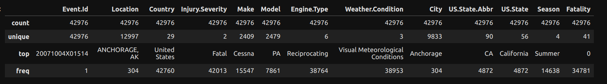
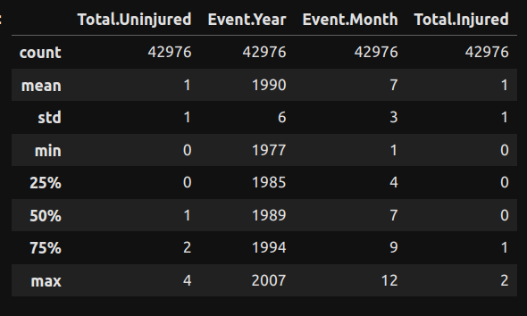
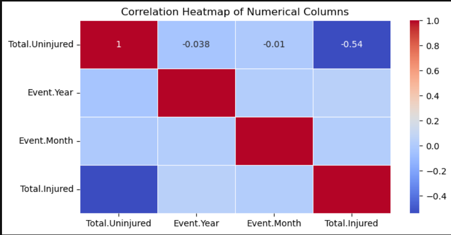

# Aviation Risk Assessment Project Overview

## STUDENT INFORMATION

* Student name: Isaac Kinyanjui Ngugi
* Student pace: Full Time Reomte
* Scheduled project review date/time: 
* Instructor name: Mark Tiba & Faith Rotich
* Google Slide: [Phase 1 Aviation Risk Analysis](https://docs.google.com/presentation/d/1WiK2iiQUtH-IwEqs-xX-qyjzECA0GWA-et_1vNcTuWs/edit?usp=sharing)
* Tableau: [Phase 1 Project Aviation Risk Analysis](https://public.tableau.com/views/Phase1ProjectAviationRiskAnalysis/Dashboard3?:language=en-GB&:sid=&:display_count=n&:origin=viz_share_link)

## Introduction

- Topic: The presentation is about Aviation Risk Analysis.
  It’s an important aspect of the aviation industry, focusing on understanding and mitigating the risks associated with different aircraft makes.

- Context:
  The company is looking to diversify its portfolio by venturing into the aviation industry.
  This involves purchasing and operating airplanes for commercial and private enterprises.
  However, the potential risks associated with different aircraft makes are not well understood.

- Importance:
  Understanding accident frequencies and fatality distributions among different aircraft makes is crucial.
  It helps in making informed decisions about which aircraft to purchase and operate, ensuring safety and efficiency in your new business endeavor.

- Approach:
  To address this, I have been working on a project that involves data cleaning, imputation, analysis, and visualization of aviation accident data.
  The goal is to generate insights that can guide the decision-making process in the company’s new aviation division.

## Business Problem
- Challenge:
  The company is expanding into new industries to diversify its portfolio.
  Specifically, it’s interested in purchasing and operating airplanes for commercial and private enterprises.
  However, the company lacks knowledge about the potential risks associated with different aircraft makes.
  
- Need:
  There’s a need to understand the accident frequencies and fatality distributions among different aircraft makes.
  This information is crucial in determining which aircraft are the lowest risk for the company as it embarks on this new business endeavor.

- Task:
  Analyzing aviation accident data to generate insights that can guide the decision-making process.
  These insights will help the head of the new aviation division decide which aircraft to purchase.
  The challenge is to translate the findings from the data into actionable insights that can be easily understood and used by the business stakeholders.

## The Data
The dataset used in this analysis is sourced from the [National Transportation Safety Board](https://www.kaggle.com/datasets/khsamaha/aviation-accident-database-synopses).
It contains information about civil aviation accidents and selected incidents in the United States and international waters from 1962 to 2023. 
The choice of data to use, how to handle missing values, aggregate the data, and visualize it in an interactive dashboard is left to the discretion of the data analyst.

## Tools and Libraries Used
- Python
- Pandas
- NumPy
- Matplotlib
- Seaborn
- Plotly Express

## Data Preparation
The first step in the project is data preparation, which includes loading the aviation data from CSV files, handling missing values, and cleaning and preprocessing the data. This involves tasks such as standardizing categorical data and filling in missing values in specific columns.

## Exploratory Data Analysis (EDA)
The EDA stage involves analyzing trends and patterns in the data to gain a better understanding of the dataset and derive insights. This includes visualizing the geographical distribution of accidents, investigating the relationship between various factors like weather conditions and accident frequencies, and exploring the distribution of severity categories and engine types involved in accidents.

## Statistical Analysis
Statistical analysis is conducted to derive meaningful insights and identify patterns in the data. This includes performing summary statistics for numerical columns and correlation analysis to identify relationships between numerical variables.

## Data Visualization
Data visualization techniques are used to effectively present the findings and communicate insights. This includes creating various types of plots and visualizations to illustrate the distribution of accidents by various factors and exploring correlations between numerical variables.

* Dashboard 1

* Dashboard 2

* Dashboard 3

## Solution
- Data Analysis Process:
  It has undertaken a comprehensive data analysis process to address the problem. This involves:
    * Data Cleaning and Imputation: Preparing the data for analysis by cleaning and filling in missing values.
    * Analysis: Analyzing accident frequency by make, model, year, season, and weather conditions.
    * Visualization: Creating visual representations of the data to better understand the patterns and trends.

- Key Findings: The analysis has yielded several key findings:
    * Top Aircraft Makes with Highest and Lowest Accident Frequencies:
    Cessna, Piper, Beech, Bell, and Grumman have the highest accident frequencies, while Adrian, Adolfson, Acroduster, Acro, Aces, AbramsNuding, Abrams, Abraham, Abernathhy, and Abbot have the lowest.
    
    * Fatality Distribution:
      The same makes have records of both fatal and non-fatal accidents, indicating the need for robust safety measures.
      
    * Distribution of Accidents:
      The distribution of accidents by month, year, season, and weather conditions for these makes provides insights into when and under what conditions most accidents occur.

- Actionable Insights:
  Based on these findings, it provided several actionable insights:
    * Aircraft Selection:
      Consider the accident frequencies of different makes when selecting aircraft for your fleet.
    * Safety Measures:
      Invest in robust safety measures, including advanced pilot training and regular aircraft maintenance.
    * Risk Assessment:
      Conduct a comprehensive risk assessment for each make and model under consideration, taking into account not just the accident data, but also factors like the age of the aircraft, its maintenance history, and its suitability for the intended routes and operations.
    * Insurance:
      Ensure adequate insurance coverage is in place, considering the accident data when comparing insurance deals.

## Conclusion and Recommendations
The analysis provides valuable insights into aviation accidents, including trends, patterns, and factors contributing to accidents. These insights will be translated into three concrete business recommendations to guide the company's decision on which aircraft to purchase. The findings will also be communicated effectively through a storyline that the head of the aviation division can follow, with spotlight visuals that relate directly to the recommendations.